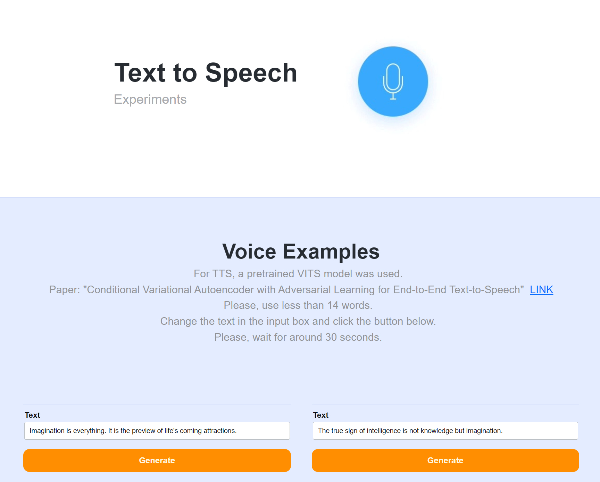

# Text to Speech - Experiments

In this experiment, various TTS models would be tested. In the first attempt, a recent TTS model, VITS, was applied. 
For this, we developed a simple webpage and microservice using React.js and FastAPI.
 
## 1. TTS models
### 1.1 VITS
- Paper: "Conditional Variational Autoencoder with Adversarial Learning for End-to-End Text-to-Speech" <a href="https://arxiv.org/abs/2106.06103" target="_blank">Link</a>. 

## 2. TTS Web
- TTS test web: <a href="https://tts-web-amngybagua-uc.a.run.app/en/intro" target="_blank">Link</a>.

  

- Components
  - Frontend:
    - Google cloud run
    - React.js
    - Next.js
    - Node.js
  - Microservice (ML worker):
    - Google cloud run
    - FastAPI
    - Pytorch

